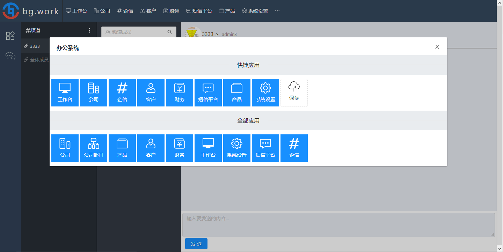
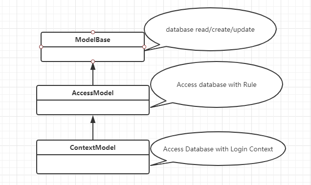

# bg.work办公系统| [bg.work framework](README.EN.md)
bg.work是综合性办公框架，
我们可以使用它完成各种类型办公系统的设计与开发，
当前框架包含：多公司、角色及权限支持，部门管理，
产品，CRM，企业内部通讯IM，企业微信，企业短信，呼叫中心等。


-------------------------------------------------------

[项目主站 https://www.bg.work ](https://www.bg.work)

-----------------------------------------------------------------------------------------

[Demo http://jinyun.bg.work:8090/ ](http://jinyun.bg.work:8090/)

-----------------------------------------------------------------------------------------
## 界面



## 框架说明

----------------------------------------------------------------------

### 数据访问

Model类图


```kotlin
 @Model(name = "customer", title="客户")
 class Customer:ContextModel("crm_customer", "public"){
     companion object: RefSingleton<Customer> {
        override lateinit var ref: Customer
      }
    val id = ModelField(null, "id", FieldType.BIGINT, "标识", primaryKey = FieldPrimaryKey())
    val name =  ModelField(null, "name", FieldType.STRING, "姓名")
    val comment =  ModelField(null, "comment", FieldType.STRING, "注释")
} 

//读取客户
  val customers = Customer.ref.rawRead()
//读取一个客户
  val customer =  Customer.ref.rawRead(criteria=eq(Customer.ref.id,1)).firstOrNull()
//读取Model内容
  val id = customer.getFieldValue(Customer.ref.id) as BigInteger?
  val name = customer.getFieldValue(Customer.ref.name) as String?
  val comment = customer.getFieldValue(Customer.ref.comment) as String?
```

这个Customer设计的不错，简单明了，没有任何妥妥拉拉的苗头，嗯，看着很棒！

一年过去了，那个很棒的攻城狮离职了，Bob坐在桌前开始增加一个 mobile

嗯，根据Bob对这个框架的理解，Bob知道可以用两种方法完成这个需求：


```kotlin

//直接增加
 @Model(name = "customer", title="客户")
 class Customer:ContextModel("crm_customer", "public"){
     companion object: RefSingleton<Customer> {
        override lateinit var ref: Customer
      }
    val id = ModelField(null, "id", FieldType.BIGINT, "标识", primaryKey = FieldPrimaryKey())
    val name =  ModelField(null, "name", FieldType.STRING, "姓名")
    val comment =  ModelField(null, "comment", FieldType.STRING, "注释")
    val mobile = ModelField(null, "mobile",FieldType.STRING,"手机号")
} 

//好了，来测试下
   val customer =  Customer.ref.rawRead(Customer.ref.mobile, criteria=eq(Customer.ref.id,1)).firstOrNull()
   val mobile = customer.getFieldValue(Customer.ref.mobile) as String?
```

```kotlin
    //第二种，来建个单独文件 MobileCustomer.kt
   @Model(name = "customer", title="客户")
   class MobileCustomer : Customer{
       companion object: RefSingleton<MobileCustomer> {
         override lateinit var ref: MobileCustomer
        }
       val mobile = ModelField(null, "mobile",FieldType.STRING,"手机号")
   }
   //好了，来测试下，没错，使用了 Customer, 框架会自动检测到 Customer 添加了 mobile
   val customer =  Customer.ref.rawRead(MobileCustomer.ref.mobile, criteria=eq(Customer.ref.id,1)).firstOrNull()
   val mobile = customer.getFieldValue(MobileCustomer.ref.mobile) as String?
```

好了，在了解了Bob出色的完成了 Customer 后，我们来简单了解下 Model的设计规则：
>什么是Model
>> Model对应业务中实体模型，从数据库角度就是对应一个 table
>
>> Model 中的 ModelField属性 对应数据库table中column

Model field 类型：

* ModelField
* Many2OneField
* Many2ManyField
* One2OneField
* One2ManyField

通过扩展Customer,我们可以很快理解这些Field的意义：

```kotlin

@Model("customer","客户")
class Customer:ContextModel("crm_customer", "public"){
        companion object: RefSingleton<Customer> {
            override lateinit var ref: Customer
        }
        val id = ModelField(null, "id", FieldType.BIGINT, "标识", primaryKey = FieldPrimaryKey())
        val name =  ModelField(null, "name", FieldType.STRING, "姓名")
        val comment =  ModelField(null, "comment", FieldType.STRING, "注释")
        val mobile = ModelField(null, "mobile",FieldType.STRING,"手机号")
        val addresses = ModelOne2ManyField(null,"addresses",FeildType.BIGINT,"地址","public.crm_customer_address","customer")
        val threePartyOAuth2Data =  ModelOne2OneField(null, "customer_id",FeildType.BIGINT,"第三方授权","public.crm_three_party_oauth2_data","customer_id", isVirtualField = True)
        val consumedProducts = ModelMany2ManyField(null,"consumed_products",FieldType.BIGINT,"已消费产品","public.crm_customer_product_rel","product_id","public.crm_product","id")
}

//每个 Customer 有多个 address
@Model("customerAddress","客户地址")
class CustomerAddress:ContextModel("crm_customer_address", "public"){
        companion object: RefSingleton<CustomerAddress> {
                override lateinit var ref: CustomerAddress
        }
        val id = ModelField(null, "id", FieldType.BIGINT, "标识", primaryKey = FieldPrimaryKey())
        val address = ModelField(null, "address",FieldType.STRING,"地址")
        val customer = ModelMany2OneField(null,"customer_id",FeildType.BIGINT,"客户","public.crm_customer","id")
}

//每个客户对应一个第三方授权数据库，每个第三方数据也对应一个客户
@Model("threePartyOAuth2Data","授权数据")
class ThreePartyOAuth2Data:ContextModel("crm_three_party_oauth2_data","public"){
      companion object: RefSingleton<ThreePartyOAuth2Data> {
          override lateinit var ref: ThreePartyOAuth2Data
      }
      val id = ModelField(null, "id", FieldType.BIGINT, "标识", primaryKey = FieldPrimaryKey())
      val openid =  ModelField(null, "open_id",FieldType.STRING,"OpenID")
      val icon =  ModelField(null, "icon", FieldType.STRING, "icon")
      val customer = ModelOne2OneField(null, "customer_id",FeildType.BIGINT,"客户","public.crm_customer","id")
}

@Model("product","公司产品")
class Product:Context("crm_product","public"){
    companion object: RefSingleton<Product> {
              override lateinit var ref: Product
    }
    val id = ModelField(null, "id", FieldType.BIGINT, "标识", primaryKey = FieldPrimaryKey())
    val name =  ModelField(null, "name", FieldType.STRING, "名称")
    val price =  ModelField(null, "price", FieldType.NUMBER, "价格")
    val typ =  ModelField(null, "typ", FieldType.STRING, "类型")
    val consumingCustomers = ModelMany2ManyField(null,"consuming_customers",FieldType.BIGINT,"消费客户","public.crm_customer_product_rel","customer_id","public.crm_customer","id")
}

@Model("customerProductRel","客户消费产品关系")
class CustomerProductRel:ContextModel("crm_customer_product_rel","public"){
    companion object: RefSingleton<CustomerProductRel> {
                  override lateinit var ref: CustomerProductRel
    }
    val id = ModelField(null, "id", FieldType.BIGINT, "标识", primaryKey = FieldPrimaryKey())
    val customer = ModelMany2OneField(null,"customer_id",FieldType.BIGINT,"客户")
    val product = ModelMany2OneField(null,"product_id",FieldType.BIGINT,"产品")
}

//读取Customer  one2one,many2one field 默认是 读取
val customer = Customer.ref.rawRead(criteria=eq(Customer.ref.id,1)).firstOrNull()
val mobile = customer.getFieldValue(Customer.ref.mobile) as String?
val threePartyOAuth2Data  = customer.getFieldValue(Customer.ref.threePartyOAuth2Data) as ModelDataObject?
val openid = threePartyOAuth2Data?.getFieldValue(ThreePartyOAuth2Data.ref.openid) as String?

// 指定要读取的 one2many field  addresses
val customer =  Customer.ref.rawRead(criteria=eq(Customer.ref.id,1),attachedFields=arrayOf(Customer.ref.addresses)).firstOrNull()
val addresses = customer.getFieldValue(Customer.ref.addresses) as ModelDataArray?
addresses?.toModelDataObjectArray()?.forEach{ address->
    val addressValue = address.getFieldValue(CustomerAddress.ref.address) as String?
}

// 指定要读取的 many2many field  consumedProducts
val customer =  Customer.ref.rawRead(criteria=eq(Customer.ref.id,1),attachedFields=arrayOf(Customer.ref.consumedProducts)).firstOrNull()
val customerProductRels = (customer.getFieldValue(Customer.ref.ConstRelRegistriesField) as ModelDataSharedObject?).data?.get(CustomerProductRel.ref) as ModelDataArray?
customerProductRels?.toModelDataObjectArray()?.forEach{ cpRel->
    val productModelDataObject = cpRel.getFieldValue(CustomerProductRel.ref.product) as ModelDataObject?
    val name = productModelDataObject?.getFieldValue(Product.ref.name) as String?
    val price = productModelDataObject?.getFieldValue(Product.ref.price) as Number?
}

// read customer + addresses + consumedProducts
val customer =  Customer.ref.rawRead(criteria=eq(Customer.ref.id,1),attachedFields=arrayOf(Customer.ref.addresses, Customer.ref.consumedProducts)).firstOrNull()
```

### 权限管理
* 针对 Model 设置 CRUD 权限
* 针对 Model field 设置 CRUD 权限
* [更多](https://www.bg.work)

### Model Action
>外部与 bg.work办公平台 交互主要调用 model action
```kotlin
class Customer:ContextModel("crm_customer","public"){
    companion object: RefSingleton<Customer> {
            override lateinit var ref: Customer
    }
    val id = ModelField(null, "id", FieldType.BIGINT, "标识", primaryKey = FieldPrimaryKey())
    val name =  ModelField(null, "name", FieldType.STRING, "姓名")
    val comment =  ModelField(null, "comment", FieldType.STRING, "注释")
    val mobile = ModelField(null, "mobile",FieldType.STRING,"手机号")
    @Action("getCustomer")
    fun getCustomer(@RequestBody data:JsonObject?):ActionResult?{
        val name = data?.get("name")
        var customer = this.rawRead(eq(this.name,name)).firstOrNull()
        var ar = ActionResult()
        ar.bag["customer"] = customer
        return ar
    }  
}
```
调用样例
```javascript
 let name = "c_name"
 $.ajax({
    url:"http://bgworkserver/ac/app/customer/getCustomer",
    type:"POST",
    contentType:"application/json",
    data:{name},
    success:function(data){
        
    }
 })
```

### 界面

+ 配置化
    + 界面设置
 ```xml
<model name="productAttribute" app="product">
        <view type="list">
            <ref>
                <actions>
                    <action>
                        <group name="main"  refType = "main"></group>
                    </action>
                    <action>
                        <group name="opAction"  refType = "main"></group>
                    </action>
                    <action>

                    </action>
                </actions>
                <views>

                </views>
                <menus>

                </menus>
            </ref>
            <field name="id"></field>
            <field name="name" type="static"></field>
            <field name="comment" type="static"></field>
        </view>
        <view type="create">
            <ref>
                <actions>
                    <action>
                        <group name="main"  refType = "main"></group>
                    </action>
                </actions>
                <menus>
                </menus>
                <views>
                    <view type="list" ownerField="values" model="productAttributeValue" refType="sub|main">
                    </view>
                </views>
            </ref>
            <field name="name" type="singleLineText" style="head"></field>
            <field name="comment" type="multiLineText" style="normal"></field>
            <field name="values" style="relation"></field>
        </view>
        <view type="edit">
            <ref>
                <actions>
                    <action>
                        <group name="main"  refType = "main"></group>
                    </action>
                </actions>
                <menus>
                </menus>
                <views>
                    <view type="list" ownerField="values" model="productAttributeValue" refType="sub|main">
                    </view>
                </views>
            </ref>
            <field name="name" type="singleLineText" style="head"></field>
            <field name="comment" type="multiLineText" style="normal"></field>
            <field name="values" style="relation"></field>
        </view>
        <view type="detail">
            <ref>
                <actions>
                    <action>
                        <group name="main"  refType = "main|sub"></group>
                    </action>
                </actions>
                <menus>
                </menus>
                <views>
                    <view type="list" ownerField="values" model="productAttributeValue" refType="none">
                    </view>
                </views>
            </ref>
            <field name="name" type="static" style="head"></field>
            <field name="comment" type="static" style="normal"></field>
            <field name="values" style="relation"></field>
        </view>
    </model>
```
   + 界面继承
```xml
  <inherit>


        <xpath expression="/ui/model[@app='core'][@name='partner']/view/edit" op="append" app="core">
            <field name="events" style="relation"/>
            <field name="customers" style="relation"/>
            <field name="leads" style="relation"/>
            <field name="orderInvoices" style="relation"/>
            <field name="orderReceipts" style="relation"/>
        </xpath>

        <xpath expression="/ui/model[@app='core'][@name='partner']/view/detail" op="append" app="core">
            <field name="events" style="relation"/>
            <field name="customers" style="relation"/>
            <field name="leads" style="relation"/>
            <field name="orderInvoices" style="relation"/>
            <field name="orderReceipts" style="relation"/>
        </xpath>

        <xpath expression="/ui/model[@app='product'][@name='product']/view/detail" op="append" app="product">
            <field name="customerOpportunities" style="relation"/>
        </xpath>
        <xpath expression="/ui/model[@app='product'][@name='product']/view/edit" op="append" app="product">
            <field name="customerOpportunities" style="relation"/>
        </xpath>
    </inherit>
```
#### 说明
>field
>>name 对应的属性名称
>
>>type 对应界面控件
>
>>style 对应界面控件所在位置
>
>> enable 控件是否可用
>
>>visible 控件是否可见
>
>
>
>
>
>
>
>---------------------------------------------------------------
### visible 或 enable 表达式
```text
 visible = true //显示控件
 enable = true //控件可用

 visible = id>0 //model id 大于 0 时显示
 enable = id!=0 //model id 不等于 0 时 可用

 visible == (id>0 and name!="") or age<11 //id 大于0 且 name 不为空 或者  age 小于 11 时可见
 enable = name=="Bob" //当 name 等于 Bob时，控件可用

```
### 界面继承
```text
 界面继承是为了解决通过Model继承添加的字段也可以通过XML界面继承来添加
```

+ 个性化
> React
>
>Rect Router
>
>Redux
>
>Ant Design React
>
>bg.work Tag Hook
>
>
[bg web client 代码 ](https://github.com/ouliuying/bgapp)
```javascript
    class BaseView extends React.Component{
        render(){
            let self = this
            return <hookView.HookProvider value={{cmmHost:self.cmmHost,parent:self}}>
                        <div>
                            <hookView.Hook hookTag="header"  render={()=>{
                                   return <div>Header</div>
                             }}></hookView.Hook>
                             <hookView.Hook hookTag="body"  render={()=>{
                                    return <div>body</div>
                              }}></hookView.Hook>
                              <hookView.Hook hookTag="footer"  render={()=>{
                                    return <div>footer</div>
                              }}></hookView.Hook>
                        <div>
                   </hookView.HookProvider>
        }
    }
    export default hookView.withHook(withRouter(connect(mapStateToProps)(BaseView)))
```
个性化BaseView
```javascript
     import  BaseView from './BaseView'
     class CustomView extends React.Component{
           overrideRender(hookTag,props){
                switch(hookTag){
                    case "header":
                        {
                            return <div>custom header</div>
                        }
                     case "body":
                        {
                            return <div>custom body</div>
                        }
                     case "header":
                        {
                            return <div>custom footer</div>
                        }                        
                    default:
                            return null
                }
            }
            render(){
                let self = this
                return <hookView.HookProvider value={{cmmHost:self.cmmHost,parent:self}}>
                         <BaseView />
                       </hookView.HookProvider>
            }
        }
        export default hookView.withHook(withRouter(connect(mapStateToProps)(CustomView)))
```


### 部署

* 安装 redis server
* 安装 kafka server
* 安装 postgresql 数据库
* git clone bgserver
* git clone bgapp
* 在postgresql 建立数据库(如： bg_work)
* 在spring.properties中配置相应的redis,kafka,jdbc
* 运行bgserver,然后在postgresql中执行 初始化脚本 start.sql
* 运行bgapp 用户：admin 密码：admin 登录

### 业务扩展
|   |  |
| ------------- | ------------- |
| 支持 | [金云办公 https://www.bg.work ](https://www.bg.work)|
| 办公设计交流 ||
| 开发交流 ||
| 项目合作 ||


